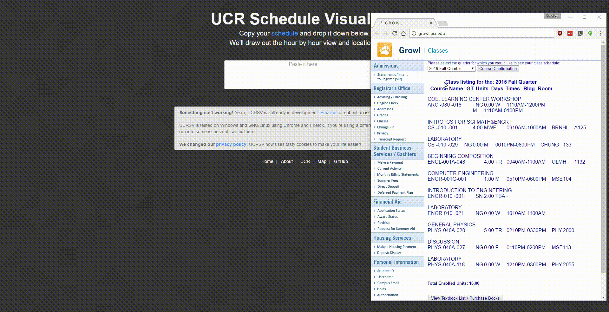

UCR Schedule Visualizer
=======================

For visualizing that unreadable [GROWL](https://ucribm.ucr.edu/Paws/PAWS.html) schedule.

Paste in your schedule, and get a weekly calendar of your classes. You'll also get links to more course details and the location of your classrooms. You can save the calendar by downloading as an image. Or just come back and it'll still be here.

This project is a static client side website written in HTML, CSS, and JavaScript. Your security and privacy is ensured because
all of the schedule interpreting and viewing is done locally. No personal schedule
related information is sent over the web.

[GitHub Pages](https://bradleycai.github.io/ucr-schedule-visualizer/)
--------------------------------------------------------

This project is hosted on GitHub pages. You can check out the current stable release
of our website using the link above.

Because the GitHub pages branch is the equivalent of a master branch, the gh-pages
branch is our master branch.

We are using the [Akari Link Shortener](https://waa.ai/) to create a short URL: [https://waa.ai/ucrsv](https://waa.ai/ucrsv). The
first three characters "ucr" refers to our school's name, and the last 2 characters "sv" are short for "schedule visualizer". We also have [a QR code](http://bradleycai.github.io/ucr-schedule-visualizer/img/waaai-qr.png).

End of life
-----------

With UCR's recent switch to Banner, we've decided to stop working on UCRSV. We plan to add minimal compatibility for it's schedule, but that'll be the last thing we do for this website. You can read more about it [here](https://bradleycai.github.io/ucr-schedule-visualizer/about.html#end)

Contributing
------

Feel free to pick up where we left off! You can @ us on our [discord dev server](https://discord.gg/0vTWbxIL45ClG4mV) if you have any questions.

Credits
-------

<ul>
  <li>Lots of inspiration from <a href="https://github.com/nokonoko/Pomf">pomf</a></li>
  <li><a href="https://jquery.com/">jQuery</a></li>
  <li><a href="http://getbootstrap.com/">Bootstrap</a></li>
  <li><a href="https://github.com/eligrey/FileSaver.js/">FileSaver.js</a></li>
  <li><a href="https://github.com/eligrey/canvas-toBlob.js">Canvas-toBlob.js</a></li>
  <li><a href="https://github.com/eligrey/Blob.js">Blob.js</a></li>
  <li><a href="https://necolas.github.io/normalize.css/">normalize.css</a></li>
  <li><a href="https://github.com/js-cookie/js-cookie">js-cookie</a></li>
</ul>

Coded with love and care by [Bradley](https://github.com/BradleyCai) and [Ammon](https://github.com/ammongit).

If you'd like to contact us our emails are [bradleycai24@gmail.com](mailto:bradleycai24@gmail.com) (Bradley) or [ammon.i.smith@gmail.com](mailto:ammon.i.smith@gmail.com) (Ammon). Our public keys are located in the `etc` directory of this repo.

We also have a [discord server](https://discord.gg/0vTWbxIL45ClG4mV) if you'd like to contact us there.

License
-------

[The MIT License](LICENSE.md): Do what ever you want with our code so long as you give attribution :heart:. This project is intended for public use and for personal learning and enjoyment.

We also have a few dependencies that make this project work. They're all free software,
and their licenses are listed inside the files themselves.
